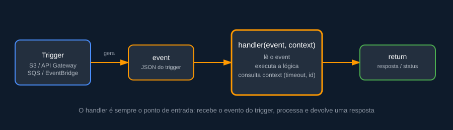
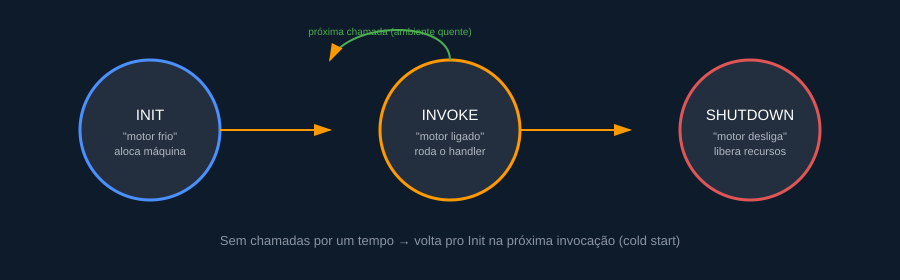

# Fundamentos de AWS Lambda — anotações de estudo com exemplo prático

> Resumo de estudo sobre computação serverless com AWS Lambda: como uma função funciona por dentro, o ciclo de vida do ambiente de execução e o modelo de cobrança — ilustrado com um exemplo de processamento de pedidos.

## O que é AWS Lambda

AWS Lambda é o serviço de computação da AWS que executa código sob demanda, sem que você precise provisionar, atualizar ou escalar servidor nenhum. Você entrega a função, define o que deve disparar sua execução, e a AWS cuida do resto: aloca recursos, escala automaticamente com o volume de chamadas e cobra apenas pelo que for de fato executado.

Esse é o princípio central do **serverless**: a infraestrutura vira responsabilidade do provedor de nuvem, e o time de desenvolvimento foca no código.

## Anatomia de uma função Lambda

Toda função Lambda gira em torno de três peças: o **handler** (ponto de entrada), o **event** (dados de quem disparou a execução) e o **context** (metadados sobre a própria execução, como tempo restante até o timeout).



Um exemplo de handler em Python, processando um pedido recebido via API:

```python
def handler(event, context):
    corpo = json.loads(event["body"])
    pedido_id = corpo["pedido_id"]
    valor = corpo["valor"]

    print(f"Tempo restante antes do timeout: {context.get_remaining_time_in_millis()}ms")

    return {
        "statusCode": 200,
        "body": json.dumps({"pedido_id": pedido_id, "status": "recebido"})
    }
```

O `event` traz o que aconteceu (aqui, o corpo da requisição HTTP); o `context` traz informações sobre a execução em si — nome da função, ID da invocação, tempo restante antes do timeout.

## Triggers: o que acorda uma função Lambda

Uma função Lambda não fica esperando requisições como um servidor tradicional — ela é **acionada por um evento externo**, chamado de trigger. Os mais comuns:

- Requisição HTTP via **Amazon API Gateway**
- Upload de arquivo em um bucket **S3**
- Mensagem em uma fila **SQS** ou stream **Kinesis**
- Agendamento periódico via **EventBridge** (ex.: todo dia às 3h)
- Alterações em uma tabela **DynamoDB** (streams)

Cada trigger formata o `event` de um jeito diferente. Um upload de arquivo em um bucket S3, por exemplo, chega mais ou menos assim:

```json
{
  "Records": [
    {
      "eventName": "ObjectCreated:Put",
      "s3": {
        "bucket": { "name": "pedidos-notas-fiscais" },
        "object": { "key": "notas/pedido-4521.pdf", "size": 88214 }
      }
    }
  ]
}
```

Com esse evento, a Lambda sabe exatamente qual arquivo foi enviado e em qual bucket — o suficiente para, por exemplo, baixar o PDF e extrair os dados da nota fiscal.

## Ciclo de vida do ambiente de execução

Por trás da promessa de "sem servidor" existem, sim, máquinas sendo alocadas — só que você não precisa gerenciá-las. O ambiente de execução passa por três fases:



- **Init** — a AWS aloca uma máquina, prepara o runtime da linguagem escolhida e carrega o código. Tudo que está fora do handler (imports, conexões, variáveis globais) roda aqui.
- **Invoke** — o ambiente já está pronto, e o handler é chamado de fato. Chamadas seguintes, enquanto o ambiente segue "quente", pulam direto para esta fase.
- **Shutdown** — depois de um tempo sem receber chamadas, a AWS libera os recursos. A próxima invocação vai precisar passar pelo Init de novo.

Esse reaproveitamento do ambiente "quente" é o motivo pelo qual a segunda chamada de uma função costuma ser bem mais rápida que a primeira.

## Cold start: o custo da flexibilidade

**Cold start** é o nome dado à latência extra que acontece quando uma função precisa passar pela fase de Init antes de processar a chamada — seja porque é a primeira invocação, seja porque o ambiente anterior já foi desligado por inatividade. Funções com mais dependências para carregar ou runtimes mais pesados (Java, .NET) tendem a sofrer mais com isso do que Python ou Node.js.

Para mitigar: manter o pacote de deploy enxuto, usar Provisioned Concurrency em endpoints críticos, e evitar inicializações pesadas fora do necessário no escopo global do código.

## Quanto custa rodar uma Lambda

O modelo de cobrança segue uma fórmula simples: **quantidade de invocações + duração de execução**. A duração, porém, não é medida só em tempo — ela é multiplicada pela memória configurada para a função, resultando na unidade **GB-segundo**. Ou seja: quanto mais memória alocada, mais cara cada invocação, ainda que o tempo de execução seja o mesmo.

A camada gratuita cobre 1 milhão de invocações e 400 mil GB-segundos por mês, sem data de expiração — suficiente para boa parte dos projetos de estudo e portfólio.

Esse modelo é vantajoso para cargas de tráfego variável ou imprevisível. Já em sistemas com carga alta e constante, vale comparar o custo com uma alternativa sempre ligada (EC2/ECS), usando o AWS Pricing Calculator.

## Exemplo prático: processador de pedidos assíncrono

Juntando os conceitos acima, um exemplo simples de função orientada a evento: sempre que um pedido é publicado em uma fila SQS, a Lambda processa o pagamento e atualiza o status no DynamoDB.

```python
import boto3
import json

tabela = boto3.resource("dynamodb").Table("pedidos")

def handler(event, context):
    for registro in event["Records"]:
        pedido = json.loads(registro["body"])

        tabela.update_item(
            Key={"pedido_id": pedido["pedido_id"]},
            UpdateExpression="SET status = :s",
            ExpressionAttributeValues={":s": "processado"}
        )

    return {"statusCode": 200, "body": f"{len(event['Records'])} pedido(s) processado(s)"}
```

Esse padrão — fila como trigger, Lambda como processador, DynamoDB como estado — é comum em sistemas de e-commerce e pipelines assíncronos, e serve como ponto de partida para expandir com notificações (SNS), retries e dead-letter queues.

## Referências

- [AWS Lambda — documentação oficial](https://aws.amazon.com/lambda/)
- [AWS Pricing Calculator](https://calculator.aws/)

---

*Anotações de estudo produzidas para portfólio pessoal de projetos serverless, com exemplos e diagramas autorais.*
